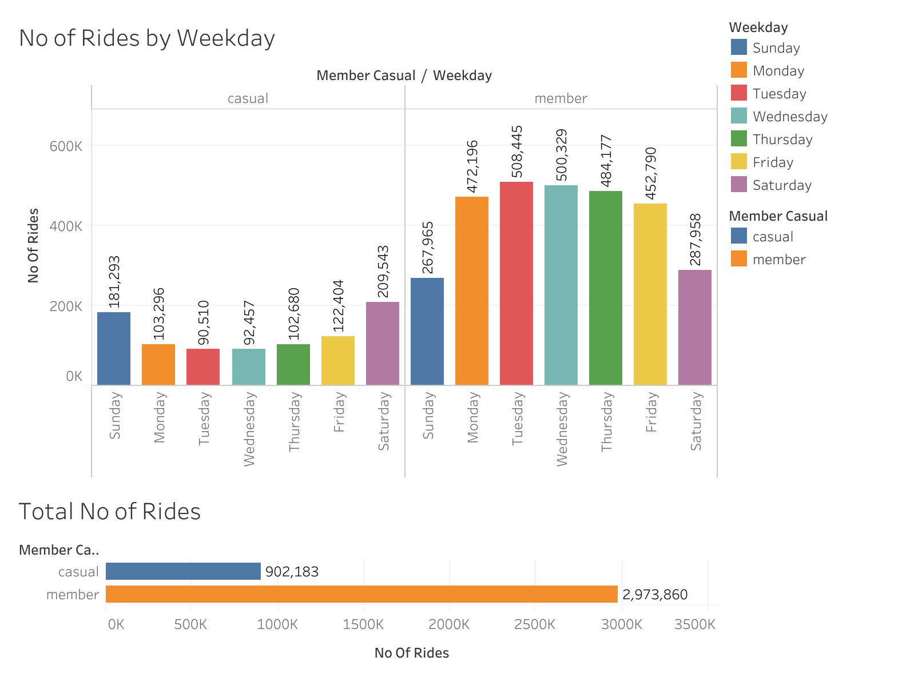
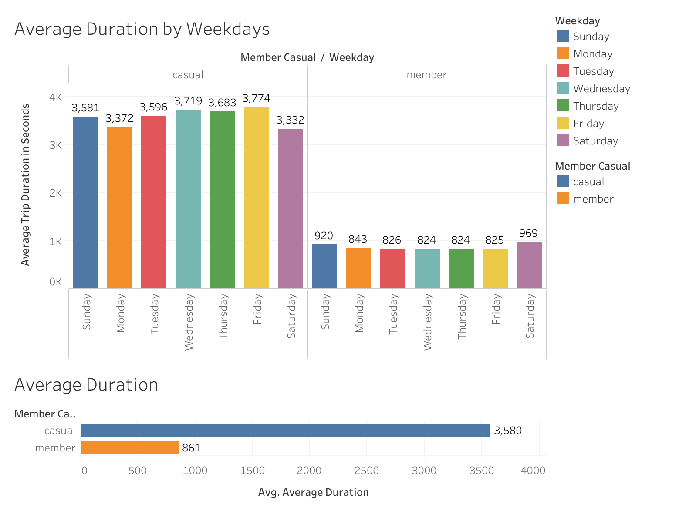

# Divvy Bike Sharing Company
Case study for Cycling company Divvy analysing usage patterns for shared bike service.

## Tools Used
Microsoft Excel,R Language, SQL, Tableau

## Data Sources

The data used for this analysis was obtained from the Divvy bike-share program for the following quarters:
- Q2 2019
- Q3 2019
- Q4 2019
- Q1 2020

The dataset contains information about ride duration, start and end times, stations, and user type.

## Data Preparation, Cleaning, and Manipulation

### Cyclistic_Exercise_Full_Year_Analysis

The R script "Cyclistic_Exercise_Full_Year_Analysis" was utilized to prepare, clean, and manipulate the data. Here's an overview of the steps performed:

1. **Data Collection**: CSV files for each quarter were uploaded and imported into R using the `read_csv` function.

2. **Data Wrangling and Combination**: Column names were compared across files, and inconsistencies were addressed. The dataframes were combined into one using the `bind_rows` function.

3. **Data Cleanup**: 
   - Inconsistent user type labels were standardized to "member" and "casual".
   - Additional columns were added for date, month, day, year, and day of the week.
   - Calculated field for ride length (in seconds) was added.

4. **Descriptive Analysis**: Descriptive statistics were calculated for ride length, including mean, median, max, and min. Analysis was conducted to compare ride length between member and casual users.

5. **Visualization**: Visualizations, such as bar charts, were created to illustrate the number of rides and average duration by user type and weekday.

6. **Export**: Summary data was exported to a CSV file for further analysis.

## Key Findings

1. **Number of Rides by Weekday**:
   - Casual users: Most rides occurred on Saturday and Sunday, with counts of 209,543 and 181,293, respectively. Tuesday had the lowest count (90,510).
   - Members: Weekdays saw higher usage, with Tuesday having the highest count (508,445). Fridays had the lowest count (452,790), and weekends combined had a count of 287,958.

2. **Total Number of Rides**:
   - Casual users: 902,183 rides.
   - Members: 2,973,860 rides.

3. **Average Duration by Weekday**:
   - Casual users: Friday had the longest recorded duration (3,774 seconds), while Monday had the shortest (3,372 seconds).
   - Members: Saturday had the longest average duration (969 seconds), while Wednesday and Friday had the shortest (824 seconds).
   - Overall, casual users had a higher average duration (3,580 seconds) compared to members (861 seconds).

### Final Conclusion

Based on the analysis conducted on the Cyclistic bike-share program data, the following conclusions have been drawn:

1. **Usage Patterns**: There are distinct usage patterns between casual users and members. Casual users tend to utilize the service more on weekends, while members predominantly use it on weekdays.
2. **Ride Duration**: Casual users tend to have longer average ride durations compared to members.
3. **Total Usage**: While casual users contribute a significant number of rides, members account for the majority of total rides.

### Application of Insights

To leverage these insights effectively, the team and business could consider the following strategies:

1. **Targeted Marketing**: Develop targeted marketing campaigns tailored to the specific preferences and behaviors of casual users and members. For example, promote weekend discounts or events to attract more casual users, while offering weekday incentives or promotions to encourage member usage during off-peak times.
  
2. **Service Improvements**: Identify areas for service improvements based on user feedback and analysis findings. For instance, if casual users are utilizing the service for longer durations, consider introducing features such as extended rental options or amenities geared towards enhancing the user experience for longer rides.

3. **Membership Programs**: Introduce membership programs or perks aimed at incentivizing casual users to become members. Highlight the benefits of membership, such as discounted rates, priority access to bikes during peak hours, or exclusive events, to encourage conversion and long-term engagement.

### Next Steps

Based on the conclusions and application of insights, the next steps for the team and stakeholders could include:

1. **Implementation Planning**: Develop a detailed implementation plan outlining the specific actions, timelines, and resources required to execute the identified strategies effectively.

2. **Monitoring and Evaluation**: Establish metrics and key performance indicators (KPIs) to monitor the impact of implemented initiatives over time. Regularly evaluate the success of the strategies and make adjustments as needed based on ongoing analysis and feedback.

3. **Stakeholder Communication**: Communicate the findings, recommendations, and action plan to relevant stakeholders across the organization. Foster collaboration and alignment to ensure everyone is working towards common objectives and goals.

By taking proactive steps to apply the insights gained from the analysis, the Cyclistic team can optimize its operations, enhance user satisfaction, and drive growth in both casual and member segments of the bike-share program.

